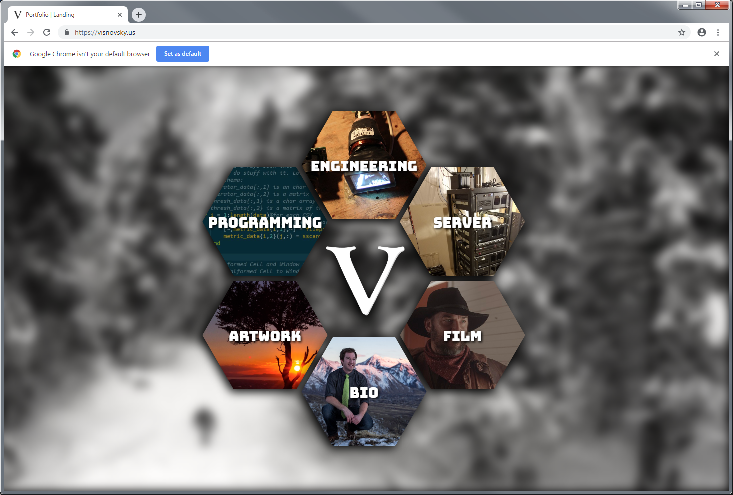

PORTFOLIO WEBSITE
========================

View the site: https://visnovsky.us

Screenshot:


This site utilizes some code from https://github.com/nasirkhan/honeycombs

## Updating Composer
To update Composer, follow these steps:
1. Navigate to the project directory:
```bash
cd /mnt/c/Users/mattv/Downloads/Git Repos/portfolio-website
Run the composer update command:
```bash
composer update